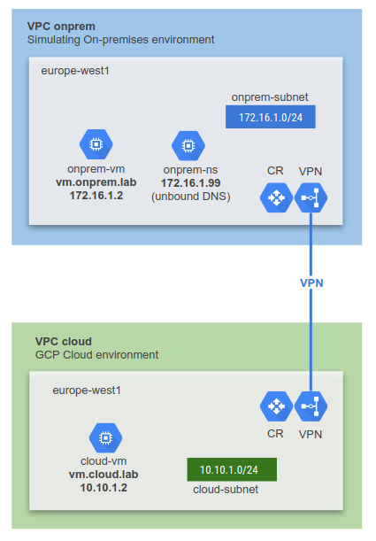

# LAB 1: HA VPN from GCP to GCP
This terraform code deploys:
1. On-premises environment simulated in GCP
2. A GCP Cloud environment
3. HA VPN between on-premises and GCP


---

## Prerequisite
- Terraform 0.12 required.
- Activate `Compute Engine API`

### Clone Lab
Open a Cloud Shell terminal and run the following command:
1. Clone the Git Repository for the labs
```sh
git clone https://github.com/kaysal/training.git
```

2. Change to the directory of the cloned repository
```sh
cd ~/training/codelabs/lab1-vpn
```

## Deploy Lab

Set your project ID as an environment variable. Replace `[PROJECT_ID_HERE]` with your Project ID in the command below:
```sh
export TF_VAR_project_id=[PROJECT_ID_HERE]
```
To deploy the infrastructure, run the following command:
```sh
./apply.sh
```
To destroy the infrastructure, run the following command:
```sh
./destroy.sh
```
