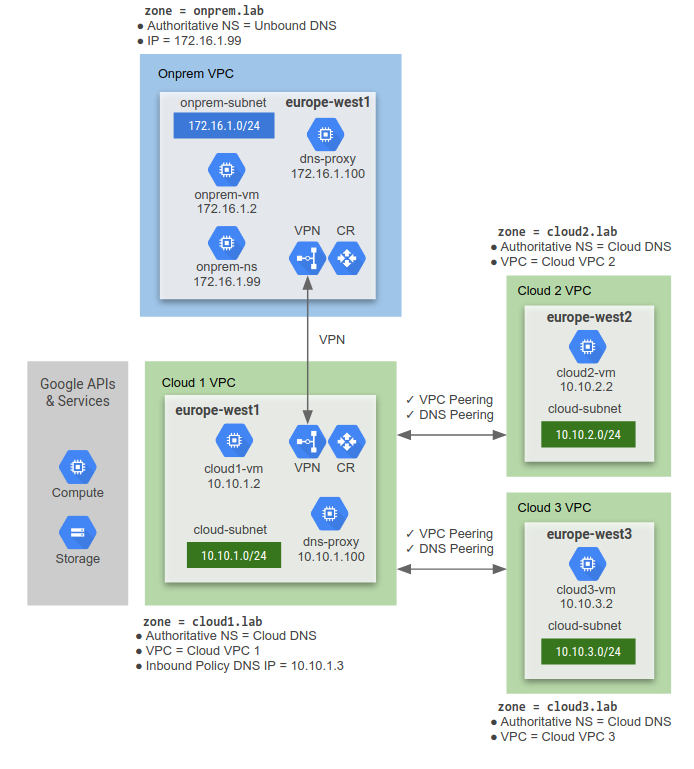

# LAB 4: Private DNS and DNS Peering

This terraform code deploys a Private DNS and DNS Peering demo lab.

Some APIs (e.g. storage.googleapis.com) are routed over VPN to the restricted.googleapis.com; while other APIs (e.g. compute.googleapis.com") are routed over the Internet.

See `LAB 3B` which forms the basis of this lab.

The on-premises environment uses unbound DNS for both private DNS resolution and restricted.googleapis.com IP address range resolution for Private Google Access over the VPN. The lab consists of the following:
1. On-premises environment simulated in GCP
2. A GCP Cloud environment
3. HA VPN between on-premises and GCP
4. Private DNS and Private Google Access on-premises using unbound
5. Private Cloud DNS and Private Google Access in GCP
6. DNS Peering


---

## Prerequisite
- Terraform 0.12 required.
- Activate `Compute Engine API`

### Clone Lab
Open a shell terminal and run the following command:
1. Clone the Git Repository for the labs
```sh
git clone https://github.com/kaysal/training.git
```

2. Change to the directory of the cloned repository
```sh
cd ~/training/codelabs/lab4-dns-p
```

## Deploy Lab

Set your project ID as an environment variable. Replace `[PROJECT_ID_HERE]` with your Project ID in the command below:
```sh
export TF_VAR_project_id=[PROJECT_ID_HERE]
```
To deploy the infrastructure, run the following command:
```sh
./apply.sh
```
To destroy the infrastructure, run the following command:
```sh
./destroy.sh
```
